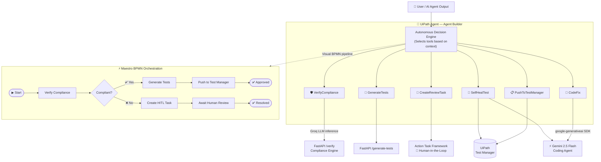

# 🛡️ AgentGuard

<div align="center">

### *"In the agentic enterprise, who watches the watchers? AgentGuard does."*

**The AI agent that governs other AI agents — and autonomously self-heals their tests when they break.**

---


</div>

---

> 🏆 **Built for UiPath AgentHack 2026 · Track 3: UiPath Test Cloud (Agentic Software Testing)**

---

## 📋 Table of Contents

- [The Problem](#-the-problem)
- [The Solution](#-the-solution)
- [Architecture](#-architecture)
- [Tech Stack](#-tech-stack)
- [The 6 Agent Tools](#-the-6-agent-tools)
- [Key Features](#-key-features)
- [🤖 Coding Agent Bonus](#-coding-agent-bonus-documentation)
- [🔰 First-Time Builder](#-first-time-builder)
- [Setup & Installation](#-setup--installation)
- [Repo Structure](#-repo-structure)
- [Challenges Overcome](#-challenges-overcome)
- [Business Impact](#-business-impact)
- [Demo](#-demo)

---

## 🔥 The Problem

Enterprises are racing to deploy **hundreds of autonomous AI agents** across critical workflows — banking, insurance, claims processing, customer operations. But this creates a dangerous **governance vacuum**.

| Pain Point | Impact |
|---|---|
| 🚫 Test suites are blind to LLM hallucinations | Compliance violations slip through undetected |
| 💥 One UI update breaks hundreds of test scripts | Teams spend days on manual remediation |
| 📋 Policy drift isn't caught in real time | Regulatory exposure accumulates silently |
| 🐌 Manual test repair doesn't scale | AI agent deployment outpaces QA capacity |

**Testing must evolve from a static checkpoint into a continuous, self-healing capability.**

---

## 💡 The Solution

**AgentGuard** is an autonomous governance and self-healing testing platform built natively for UiPath Test Cloud. It acts as an **automated safety and quality supervisor** that sits across your entire AI agent fleet.

AgentGuard autonomously:

1. 🛡️ **Monitors** AI agent interactions and verifies outputs against corporate compliance guidelines in real time
2. 🧪 **Generates** fresh compliance test scenarios from natural-language requirements
3. 📋 **Pushes** tests directly into UiPath Test Manager
4. 🚨 **Escalates** violations to human reviewers via the Action Task framework
5. 🔧 **Self-heals** broken tests using Gemini 2.5 Flash as an embedded coding agent
6. ⚡ **Orchestrates** the entire pipeline through a Maestro BPMN flow with branching logic

---

## 🏗️ Architecture



**Two modes, one platform:**
- **Agent Mode** — Conversational, tool-selecting, on-demand governance
- **Maestro Mode** — Fully visual, orchestrated BPMN pipeline for production automation

---

## 🧰 Tech Stack

### UiPath Platform

| Component | Role |
|---|---|
| **UiPath Agent Builder** | Hosts the autonomous 6-tool supervisor agent (Low-code Agent) |
| **UiPath Studio Web** | 6 published API workflows wired to agent tools |
| **UiPath Test Manager** | Live test case management — push, update, retrieve |
| **UiPath Maestro (BPMN)** | Visual orchestration of the full governance pipeline |
| **UiPath Action Task Framework** | Human-in-the-loop escalation for compliance violations |
| **UiPath Automation Cloud** | Full deployment, publishing, and runtime environment |

### External AI & Backend

| Component | Role |
|---|---|
| **Gemini 2.5 Flash** | 🤖 Coding Agent — autonomous test self-healing |
| **Gemini CLI v0.49.0** | CLI interface for Gemini during development |
| **google-generativeai SDK** | Python integration for Gemini in FastAPI |
| **Groq** | Ultra-low-latency LLM inference for compliance reasoning |
| **FastAPI (Python)** | Governance API exposing all 6 tool endpoints |
| **ngrok** | Public tunnel: UiPath Cloud → local backend |
| **uvicorn** | ASGI server |

### Agent Hybrid Classification

```
🏷️  Agent Type: Hybrid
     ├── Low-code Agent  → UiPath Agent Builder (orchestration, tool selection)
     └── Coding Agent    → Gemini 2.5 Flash     (code analysis, test repair)
```

---

## 🔨 The 6 Agent Tools

| # | Tool | Endpoint | Powered By | Description |
|---|---|---|---|---|
| 1 | 🛡️ **VerifyCompliance** | `POST /verify` | Groq LLM | Validates AI agent outputs against enterprise policies in real time |
| 2 | 🧪 **GenerateTests** | `POST /generate-tests` | FastAPI | Converts plain-text requirements into structured test scenarios |
| 3 | 📋 **PushToTestManager** | `POST /test-manager/push` | UiPath Test Manager API | Pushes generated test cases directly into Test Manager |
| 4 | 📌 **CreateReviewTask** | `POST /review-task` | Action Task Framework | Creates structured human review tasks for policy violations |
| 5 | 🔧 **CodeFix** | `POST /code-fix` | Gemini 2.5 Flash | On-demand code repair with root-cause analysis |
| 6 | 🔄 **SelfHealTest** | `POST /test-manager/self-heal` | Gemini + Test Manager | **Full loop:** analyze failure → write fix → update Test Manager |

> **The agent autonomously decides which tools to invoke and in what order**, based entirely on the natural-language context of the user's request.

---

## ✨ Key Features

### 🛡️ Real-Time Compliance Guardrail

Intercepts live agent interactions mid-flight, runs policy evaluation via Groq's ultra-low-latency inference, **blocks non-compliant outputs before they propagate**, and generates structured escalation tasks with full audit trail.

### 🧪 Autonomous Test Generation

Translates plain-text business requirements written by non-technical stakeholders into **production-ready technical test cases**, automatically logged and version-tracked in UiPath Test Manager.

### 🔄 Self-Healing Test Loop

<details>
<summary>Click to expand self-heal flow</summary>

```
1. Receive: broken test code + error message/stack trace
2. Gemini analyzes:   structural failure, broken assertion, scope of fix
3. Gemini writes:     repaired code with root-cause explanation
4. Gemini returns:    confidence score + fixed code block
5. AgentGuard pushes: updated test back into Test Manager
6. Result:            zero-touch test repair, fully auditable
```

</details>

### ⚡ Dual Orchestration Modes

**Agent Mode** — Conversational, dynamic tool chaining. A user types "this test is failing" and the agent autonomously invokes `SelfHealTest` without prompting.

**Maestro Mode** — Deterministic BPMN pipeline for production governance. Every step is visible, auditable, and forkable based on business logic.

### 🎯 Multi-Tool Agent Autonomy

No hardcoded sequences. The UiPath agent evaluates intent and **dynamically chains tools** — the same agent handles compliance checks, test generation, and self-healing depending purely on what you ask it.

---

## 🤖 Coding Agent Bonus Documentation

> 📌 **This section explicitly documents Coding Agent **

| Field | Details |
|---|---|
| **Coding Agent Used** | Gemini 2.5 Flash |
| **Access Method** | Gemini CLI (v0.49.0) + `google-generativeai` Python SDK |
| **Primary Files** | `src/api_server.py` → `/test-manager/self-heal` and `/code-fix` endpoints |
| **Integration Depth** | Meaningfully embedded as Agent Tool #5 and #6 — the agent dynamically decides when to invoke Gemini |
| **Bonus Evidence** | Live screenshots in `/demo-screenshots/`, demo video with real-time Gemini output |

**How Gemini contributes:**

When AgentGuard receives a failing test report, the `SelfHealTest` tool chains the following Gemini-powered steps:

```python
# Simplified flow — see src/api_server.py for full implementation
prompt = f"""
You are an expert test automation engineer.
Analyze this failing test and return a JSON with:
- root_cause: what broke and why
- fixed_code: the complete repaired test
- confidence: 0.0 to 1.0

FAILING CODE:
{broken_test_code}

ERROR:
{error_message}
"""
response = gemini_model.generate_content(prompt)
# Parse → push fixed code to UiPath Test Manager
```

**Why this is meaningful, not cosmetic:** Gemini isn't called with a one-shot prompt and discarded. It's the **brain of the self-healing loop** — analyzing code structure, isolating broken assertions, rewriting with context, and returning structured output that UiPath workflows can consume directly. The agent autonomously decides to invoke it based on conversational signals.

---

## 🔰 First-Time Builder

> 🎉 **This is my first UiPath project ever.**

AgentGuard was designed, architected, and built **end-to-end during UiPath AgentHack 2026** as my first hands-on experience with:

- UiPath Agent Builder
- UiPath Studio Web
- UiPath Maestro (BPMN)
- UiPath Test Manager APIs
- UiPath Action Task Framework

Everything from the 6-tool agent architecture to the Maestro BPMN orchestration to the FastAPI governance backend was created from scratch within the hackathon window.

---

## 🚀 Setup & Installation

### Prerequisites

| Requirement | Notes |
|---|---|
| Python 3.10+ | `python --version` to verify |
| UiPath Automation Cloud account | Free tier works |
| Gemini API key | [Google AI Studio](https://aistudio.google.com) — free tier |
| Groq API key | [console.groq.com](https://console.groq.com) — free tier |
| ngrok | [ngrok.com](https://ngrok.com) — free tier |

---

### Step 1 — Clone & Install

```bash
git clone https://github.com/YOUR_USERNAME/agentguard.git
cd agentguard

python -m venv venv
source venv/bin/activate          # Windows: venv\Scripts\activate

pip install -r requirements.txt
```

---

### Step 2 — Configure Environment

```bash
cp .env.example .env
```

Edit `.env` with your credentials:

```env
# UiPath Automation Cloud
UIPATH_ORG=your_org
UIPATH_TENANT=DefaultTenant
UIPATH_BASE_URL=https://staging.uipath.com
UIPATH_CLIENT_ID=<your_external_app_client_id>
UIPATH_CLIENT_SECRET=<your_external_app_secret>
UIPATH_FOLDER_ID=<your_folder_id>
UIPATH_TENANT_ID=<your_tenant_id>

# Test Manager
TEST_MANAGER_PROJECT_ID=<your_test_manager_project_uuid>
TEST_MANAGER_BASE_URL=https://staging.uipath.com/{org}/{tenant}/testmanager_/api/v2

# AI Keys
GEMINI_API_KEY=<your_gemini_key>
GEMINI_MODEL=gemini-2.5-flash
GROQ_API_KEY=<your_groq_key>

# Tunnel
NGROK_URL=<your_ngrok_url>
```

---

### Step 3 — Start the Backend

```bash
# Terminal 1 — FastAPI server
python src/api_server.py
# → Running on http://localhost:8000

# Terminal 2 — ngrok tunnel
ngrok http 8000
# → Copy the https://xxxx.ngrok.io URL into your .env NGROK_URL
```

Verify it's working:

```bash
curl http://localhost:8000/health
# {"status": "ok", "version": "1.0.0"}
```

---

### Step 4 — UiPath Cloud Setup

```
1. Studio Web
   └── Import 6 workflows from /uipath-workflows/
   └── Publish all to Shared folder

2. Agent Builder
   └── Import agent definition from /agent-config/
   └── Wire all 6 published workflows as agent tools
   └── Set Base URL → your ngrok HTTPS URL

3. Maestro
   └── Import BPMN process from /maestro/
   └── Publish the flow

4. Test Manager
   └── Note your Project UUID → add to .env
```

---

### Step 5 — Run It

Open Agent Builder → start a conversation:

```
"Verify this agent output for compliance: [paste output]"
"Generate tests for: users must not be able to transfer > $10,000 without 2FA"
"This test is broken: [paste code + error] — fix it"
```

---

## 📁 Repo Structure

```
agentguard/
├── src/
│   ├── api_server.py            # FastAPI backend — all 6 tool endpoints
│   ├── verification_engine.py   # Compliance reasoning logic (Groq)
│   └── ...
├── uipath-workflows/            # Exported API workflow .nupkg / JSON files
├── maestro/                     # Maestro BPMN process export
├── agent-config/                # UiPath Agent Builder definition
├── demo-screenshots/            # Evidence for Coding Agent bonus
│   ├── gemini-live-output.png
│   ├── test-manager-push.png
│   └── self-heal-before-after.png
├── requirements.txt
├── .env.example                 # Safe template — no secrets
├── LICENSE                      # MIT
└── README.md
```

---

## 🧗 Challenges Overcome

<details>
<summary><strong>🔀 Multi-Tool Orchestration Reliability</strong></summary>

Fine-tuning the autonomous agent so it **reliably selects the correct tool sequence** based on unstructured, natural-language input required extensive prompt engineering of the agent's system instructions. The agent must distinguish "verify this" (→ VerifyCompliance) from "this test is failing" (→ SelfHealTest) without explicit user direction.

</details>

<details>
<summary><strong>📦 Maestro Data Serialization</strong></summary>

Maestro's HTTP Connector required **JS object literal syntax** (not JSON.stringify'd strings) in the body builder. Debugging this required deep inspection of the request pipeline and ultimately a custom body-shaping pattern used across all 6 workflow integrations.

</details>

<details>
<summary><strong>🌉 Structured Runtime Bridging</strong></summary>

Gemini returns rich markdown-formatted code blocks with inline commentary. Engineering the FastAPI layer to **reliably extract, strip, and re-structure** Gemini's outputs into typed JSON that UiPath agent tools can parse required a robust post-processing pipeline with multiple fallback patterns.

</details>

<details>
<summary><strong>🔗 Studio Web Input Binding</strong></summary>

Studio Web's input binding for API workflows has documented limitations around dynamic body construction. Worked around this using **hardcoded body patterns** per endpoint with environment-variable-driven base URLs, enabling the full ngrok tunnel substitution without workflow re-publishing.

</details>

---

## 📈 Business Impact

| Metric | Before AgentGuard | After AgentGuard |
|---|---|---|
| Test repair time | Hours–days (manual) | Minutes (autonomous) |
| Compliance detection | Post-deployment audit | Real-time interception |
| Test generation | Manual authoring | Natural-language → test case |
| Governance visibility | Fragmented logs | Unified Maestro BPMN audit trail |
| Scalability | Linear with headcount | Scales with AI agent fleet |

By blending **low-code UiPath orchestration** with **Gemini-powered code intelligence**, AgentGuard transforms enterprise testing from a reactive bottleneck into a **proactive, self-healing guardrail** — one that scales automatically as the AI workforce grows.

---

## 🎬 Demo

| Asset | Link |
|---|---|
| 🎥 Demo Video | https://youtu.be/KZ6hGp10bHI?si=mE2-37cu2q1hkxl8 |
| 📊 Presentation Deck | https://docs.google.com/presentation/d/1JaN7_XKr15KBJewun8UjMO9M-5Y55ed-/edit?usp=drivesdk&ouid=113035910934048133264&rtpof=true&sd=true |
| 📸 Screenshots | [`/demo-screenshots/`](./demo-screenshots/) |

---

## 📄 License

Distributed under the MIT License. See [`LICENSE`](./LICENSE) for details.

---

<div align="center">

**Built with ❤️ for UiPath AgentHack 2026**

*Track 3: UiPath Test Cloud · Agentic Software Testing*

🛡️ **AgentGuard** · Governing the agentic enterprise, one test at a time.

</div>